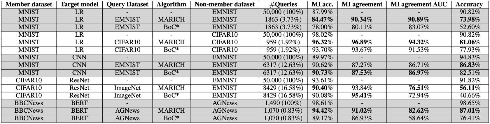

# Marich: A Query-efficient Distributionally Equivalent Model Extraction Attack using Public Data

Marich aims to extract models using public data with two motives:
1. Distributional Equivalence and
2. Query Efficiency

To achieve these two Marich uses an active learning algorithm to query and extract the target models $(f_T)$. We assume that only the labels (not the probabilities) are available from the target models. The extracted models $(f_E)$ are trained on the selected $x$'s and $\hat{y}$'s obtained from the target models.

The attack framework is as given below:

The accuracies of competing active learning methods are shown along with Marich to present a comparison:

    
 
     

The accuracy curves shown above are respectively for:
1. Logistic regression model trained on MNIST dataset extracted using another Logistic regression model with EMNIST queries.
2. Logistic regression model trained on MNIST dataset extracted using another Logistic regression model with CIFAR10 queries.
3. CNN trained on MNIST dataset extracted using another CNN with EMNIST queries.
4. BERT trained on BBC News dataset extracted using another BERT with AG News queries.
5. ResNet trained on CIFAR10 dataset extracted using a CNN with ImageNet queries.

Next we present the kl divergence between the outputs of the extracted models and the target models to compare the distributional equivalence of the models extracted by different algorithms. This is done on a separate subset of the training domain data.

     

The order of the extraction set ups are same as mentioned for the accuracies.
The table below shows a portion of the results obtained during our experiments:

There are 4 folders:
bert_al: Contains K-Center, Least Confidence, Margin Sampling, Entropy Sampling and Random Sampling codes for BERT experiments
lr_cnn_res_al: Contains K-Center, Least Confidence, Margin Sampling, Entropy Sampling and Random Sampling codes for experiments on Logistic Regression, CNN and ResNet
bert_marich: Contains Marich codes for BERT experiments
lr_cnn_res_marich: Contains Marich codes for experiments on Logistic Regression, CNN and ResNet

The jupyter notebooks provided in the folders act as demo for the users.

To experiment with new data, one needs to:
1. In data.py file, add compatible get_DATA function. Follow the structure of the existing get_DATA functions.
2. In handlers.py file add a compatible Handler class. Follow the structure of the existing Handler classes.
3. In case of Marich new data input is to be given following the jupyter notebooks.

To experiment with new models, one needs to:
1. Add the corresponding model to the nets.py file. For the active learning algorithms, other than Marich, one must remember to modify the model to have a forward method returning the output and a preferred embedding, and have a method to return the embedding dimension.

For the K-Center, Least Confidence, Margin Sampling, Entropy Sampling and Random Sampling experiments, we have modified and used the codes from https://arxiv.org/pdf/2111.15258.pdf

@article{Huang2021deepal,
    author    = {Kuan-Hao Huang},
    title     = {DeepAL: Deep Active Learning in Python},
    journal   = {arXiv preprint arXiv:2111.15258},
    year      = {2021},
}
